```{r setup, include=FALSE}
knitr::opts_chunk$set(echo = TRUE)
```

## Rys historyczny


W nowoczesnej historii świata sporty opierające się na globalnej rywalizacji między reprezentacjami państw mają stosunkowo krótką tradycję. Początkowo możliwość śledzenia tych rozgrywek była ograniczona do osób, które mogły fizycznie uczestniczyć w wydarzeniach sportowych, co wynikało z ograniczonej pojemności stadionów i aren sportowych. Jednak wraz z postępem technologicznym stopniowo rosła dostępność takich wydarzeń dla szerszej publiczności. Szczególną rolę odegrały tu media, w tym przede wszystkim telewizja, ale również radio, transmisje internetowe oraz aplikacje mobilne. Dzięki tym nowoczesnym środkom komunikacji sport stał się globalnym fenomenem, docierającym do milionów, a nawet miliardów odbiorców na całym świecie.


Wzrastająca popularność sportu szybko została zauważona i wykorzystana w celach komercyjnych. Sponsorzy, reklamy i prawa do transmisji telewizyjnych przekształciły rywalizacje sportowe w znaczący element światowej gospodarki. Dziś sport nie tylko stanowi formę rozrywki, lecz także staje się narzędziem do budowania prestiżu narodowego oraz platformą do wyrażania wartości społecznych.


Jednocześnie współczesny sport rywalizuje o uwagę z innymi formami rozrywki, takimi jak gry komputerowe, seriale, platformy streamingowe czy media społecznościowe. Alternatywne sposoby spędzania czasu, które nie wymagają fizycznej obecności ani oglądania transmisji na żywo, przyciągają coraz większą liczbę odbiorców. Co więcej, w ostatnich latach pojawiają się głosy sugerujące, że sport – zwłaszcza w tradycyjnym wymiarze – może być postrzegany jako przewidywalny lub wręcz nudny.


W niniejszym artykule postaram się przyjrzeć atrakcyjności spotkań, analizując sport z perspektywy danych dotyczących przebiegu wydarzeń sportowych. Skupię się przede wszystkim na rozgrywkach międzynarodowych w piłce nożnej, które są jednym z najbardziej rozpowszechnionych i wpływowych przykładów globalnej rywalizacji sportowej. Na podstawie dostępnych danych spróbuję ukazać, dlaczego sport wciąż przyciąga ogromne rzesze fanów oraz jakie czynniki wpływają na jego rosnącą lub malejącą atrakcyjność.


## Tradycyjne zasady, a współczesne wymagania w praktyce


Często przywoływanym argumentem we współczesnym sporcie jest kwestia intensywności oraz długości spotkań. Coraz więcej głosów opowiada się za tym, aby skracać czas trwania meczów w stosunku do  zasad ustalonych przecież dziesiątki lat temu. Dotychczas reguły dotyczące długości rozgrywek i liczby przerw uznawano za fundamentalne, przez co zmiany w tym zakresie były wprowadzane bardzo rzadko i z dużą ostrożnością. Jednak w odpowiedzi na zmieniające się potrzeby widzów, a zwłaszcza wymagania związane z transmisjami telewizyjnymi i innymi formami medialnego przekazu, coraz częściej podejmowane są próby modyfikacji tych zasad.


Przykładem sportu, który ulega tego rodzaju zmianom, jest tenis ziemny. W czterech najważniejszych turniejach tenisowy, czyli tak zwanych wielkich szlemach, wprowadzono szereg innowacji dotyczącychzasad ry. Jedną z takich zmian była rezygnacja z gry na przewagi w gemach w decydującym secie. Na turnieju ATP Next Gen, czyli niejako tenisowych mistrzostwach dla zawodników młodzieżowych, również testowane są różne zmiany. Do najważniejszych z nich należy rozgrywane każdego seta do czterech wygranych gemów, podczas gdy w tradycyjnych zasadach gra toczy się do sześciu wygranych gemów! W wielu rozgrywach deblowych i mikstowych (czyli debla, w skład którego wchodzą drużyny mieszanych płci) zmieniono zasady rozgrywania decydującego seta, zastępując go dużo szybszą do rozegrania formułą "super tie-break". Tego typu zmiany skracają czas transmisji spotkań, co jest korzystne z perspektywy nadawców telewizyjnych.


Podobne pomysły pojawiają się w kontekście piłki nożnej, choć natura tego sportu, ze względu na dynamikę gry, wymaga lekko innego podejścia. Bardziej prawdopodobną innowacją w piłce nożnej mogłoby być skrócenie czasu trwania meczu. Warto zauważyć, że analiza statystyczna ujawnia interesujące wzorce dotyczące rozkładu zdobytych bramek poszczególnych minutach meczu. Dane wskazują, że najwięcej bramek pada w drugiej połowie spotkania, a w szczególności w ostatnim kwadransie meczu, między 76. a 90. minutą. Natomiast w pierwszej połowie najwięcej goli zdobywa się w przedziale 31.-45. minuta.


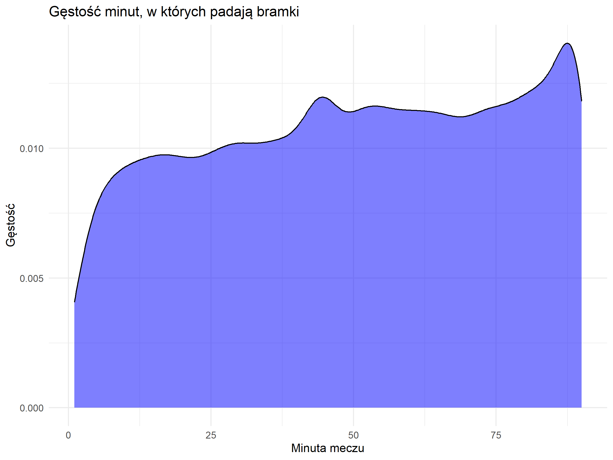

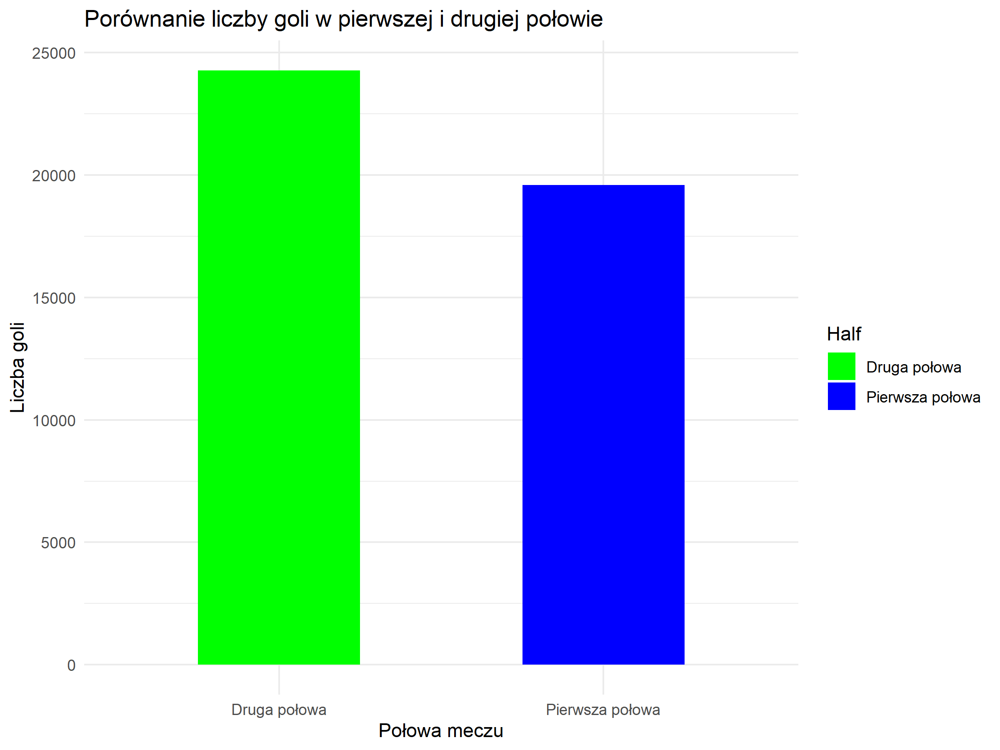

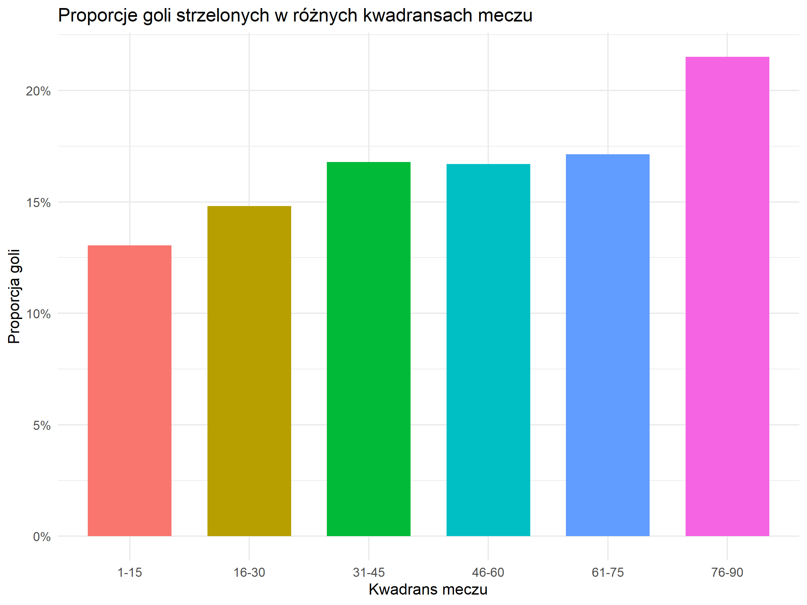


Z tych obserwacji można wyciągnąć wniosek, że końcówki połów, zwłaszcza końcówka całego meczu, są najbardziej emocjonujące dla kibiców. W związku z tym skrócenie czasu gry w odpowiedni sposób, mogłoby zachować kluczowe momenty, które budzą największe emocje.

Jeśli zerkniemy na te dane historycznie, analizując rozkład strzelonych bramek na przestrzeni dekad, zauważymy, że istnieje ogólna tendencja do zwiększania się stosunku bramek strzelonych w późniejszych minutach meczu do pierwszych minut. W szczególności, na początku ubiegłego wieku, strzelano więcej bramek w pierwszej połowie, niż w drugiej. W kolejnych dekadach tendencja się odwróciła, a w dwóch ostatnich dekadach, w ciągu drugiej połowy strzelono prawie 55% wszystkich bramek.


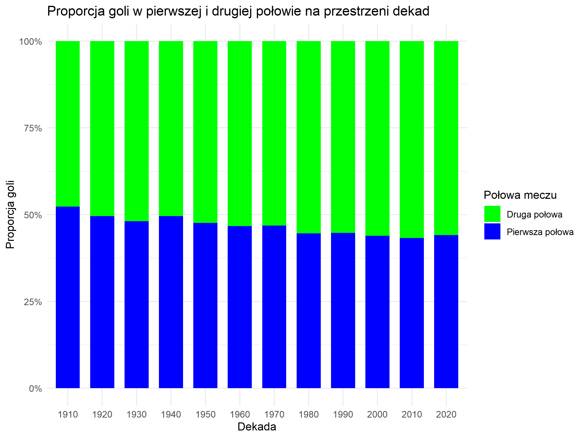


Jeśli dane rozbijemy na kwadranse, zauwazymy, że w ciągu ostatniej dekady zachodzi podobna tendencja między pierwszym, a ostatnim kwadransem. To znaczy, w tym czasie strzelono prawie dwa razy więcej bramek w ostatnim kwadransie, w porównaniu do pierwszego kwadransu.


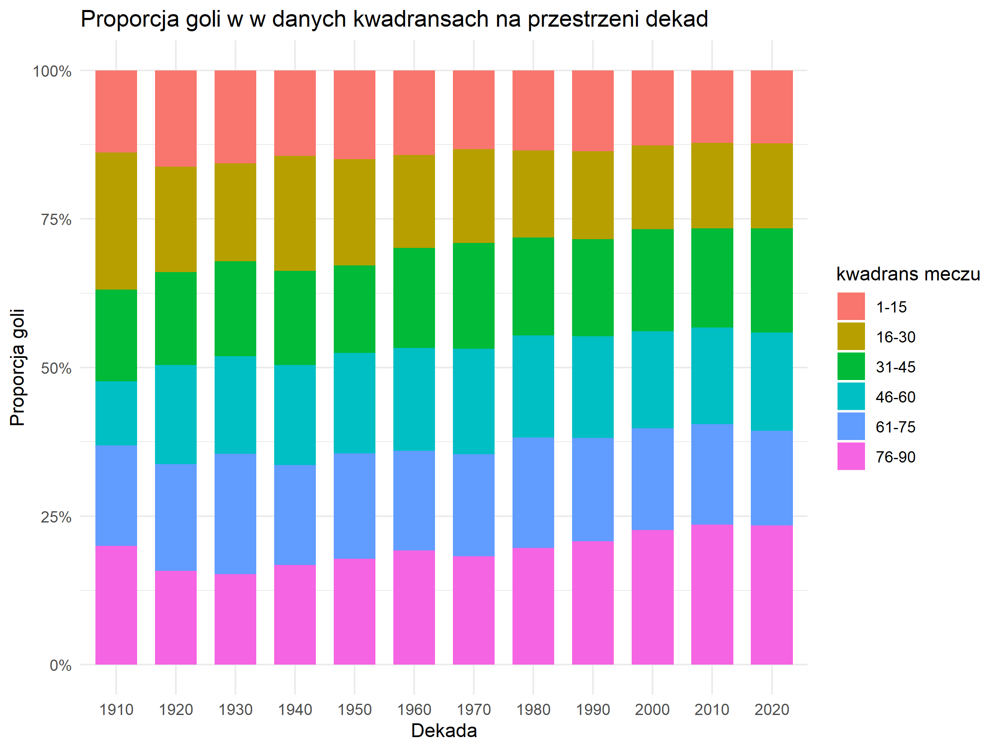


## Bramkostrzelność i inne współczynniki atrakcyjności


Kolejnym istotnym zagadnieniem w analizie piłki nożnej jest liczba strzelonych bramek, która odgrywa kluczową rolę w kontekście atrakcyjności widowiska dla kibiców. Z perspektywy widza, moment zdobycia gola jest jednym z najbardziej ekscytujących i emocjonujących wydarzeń w trakcie meczu. Bramki generują znacznie większe zainteresowanie niż dobra jakość gry w środku boiska, liczba fauli czy sposób wykonywania rzutów wolnych.

W ramach mojej analizy skupiłem się na kilku kluczowych wskaźnikach, które pozwalają ocenić atrakcyjność spotkań piłkarskich. Należą do nich:

 - **liczba strzelonych bramek na mecz** – podstawowy wskaźnik świadczący o widowiskowości spotkań,
 - **różnica strzelonych bramek między drużynami** – czynnik wskazujący, jak wyrównana była rywalizacja. Bardziej wyrównane mecze, z niewielką różnicą bramek, są zwykle bardziej emocjonujące, gdyż utrzymują napięcie do samego końca,
 - **trzeci współczynnik** – różnica strzelonych bramek podzielona przez sumę bramek. Ten wskaźnik pozwala ocenić, na ile jedna z drużyn zdominowała przeciwnika, co może mieć wpływ na postrzeganą jakość meczu.

Jeśli przyjrzeć się danym z ostatnich 20 lat, nie widać znaczących zmian w średniej liczbie strzelanych bramek ani we wspomnianych wskaźnikach. Oznacza to, że w tym okresie nie doszło do istotnych wzrostów bramkostrzelności, co może sugerować stabilizację stylu gry oraz taktyki drużyn na najwyższym poziomie rozgrywkowym. Niemniej jednak zmiany te mogą być również związane z innymi czynnikami, takimi jak większy nacisk na defensywę, lepsze przygotowanie fizyczne zawodników czy rozwój technologii analitycznych wspierających zespoły w planowaniu strategii.


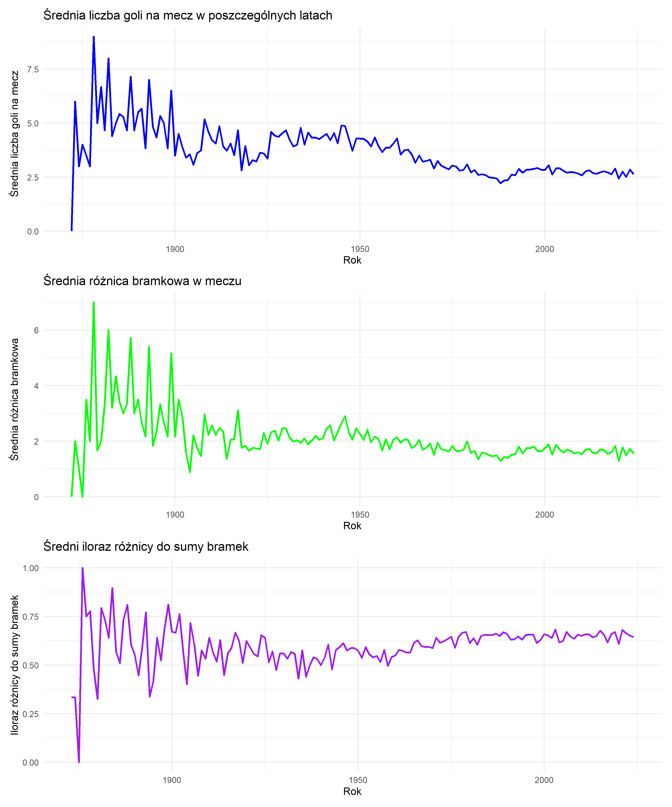

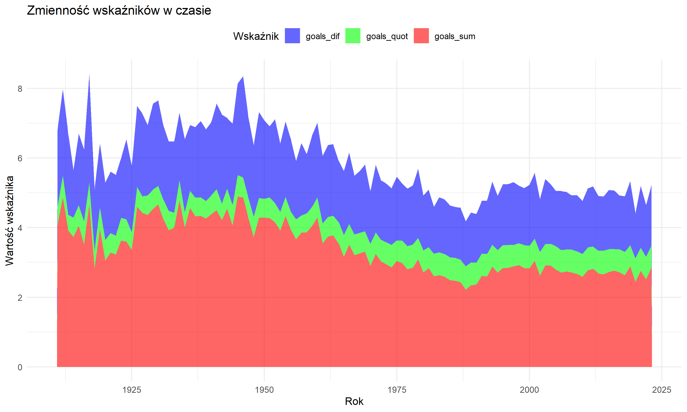

Jak widać na załącznonych obrazkach, wszystkie statystyki wyglądały różnie na przestrzeni lat, w poszczególnych okresach miały one swoje minima i ekstrema lokalne. Jednak im bliższy nam zakres lat analizujemy, tym można zauważyć, że bramek pada mniej, a statystycznie, coraz mniej zawodów kończy się dużą różnicą bramkową między rywalami.


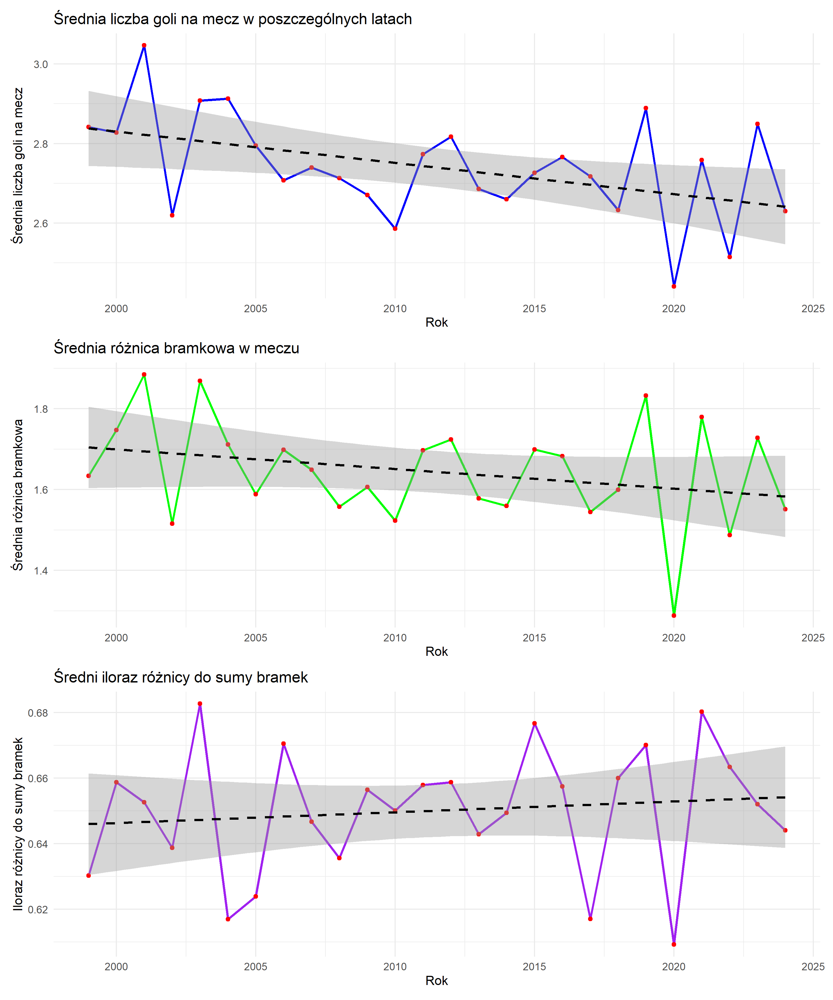

Jeśli na tapet weźmiemy najnowszą historię piłki nożnej, ostatnie 25 lat meczów o charakterze międzynarodowym, nie widać znacznego trendu spadkowego lub rosnącego w żadnym z użytych współczynników. Najbardziej wyróżnia się jednak wskaźnik bramkostrzelności, zachodzi lekki spadek, o nieco ponad 0,2 bramki na mecz. W tym samym okresie, średnia różnica bramek pomiędzy drużynami, spada o około 0,1 bramki na mecz. Ostatni współczynnik natomiast rośnie, ale jest to wzrost tylko nieco ponad 1% więcej w 2024 niż 25 lat wcześniej. 


## Rosnąca intensywność sezonu


Kolejną kwestią, którą warto poruszyć, jest zwiększona eksploatacja piłkarzy w meczach o stawkę. Współczesne realia finansowe, w tym zyski z praw telewizyjnych, skłaniają organizatorów do zwiększania liczby spotkań i drużyn biorących udział w prestiżowych turniejach i ligach. Taka strategia pozwala na zaangażowanie kibiców z większej liczby krajów, co w założeniu ma się przełożyć na większe przychody oraz szerszy zasięg medialny. Analizując dane z najważniejszych międzynarodowych turniejów, takich jak mistrzostwa świata czy mistrzostwa poszczególnych kontynentalnych federacji, wyraźnie widać trend wzrostu liczby uczestniczących drużyn i bardzo ściśle z tym wziązaną liczbę rozgrywanych spotkań.

Zwiększanie liczby drużyn i wydłużanie turniejów wpływa jednak na odbiór tych wydarzeń przez kibiców. Choć popularność piłki nożnej rośnie na całym świecie, a większa liczba meczów daje szansę na większe emocje i odkrywanie nowych talentów, wydłużenie czasu trwania zawodów sprawia, że trudno jest śledzić wszystkie spotkania. Coraz częściej turnieje tracą swój wyjątkowy charakter – kiedyś były one wydarzeniami o statusie prawdziwego święta, które z zapartym tchem obserwowali kibice na całym świecie. Obecnie natłok meczów oraz równoległe rozgrywanie różnych turniejów może powodować zmęczenie i spadek zainteresowania widzów.

Taka zmiana prowadzi do pytania, czy dalsze zwiększanie skali zawodów nie osłabi ich atrakcyjności. Wprowadzenie większej liczby spotkań i drużyn wymaga wyważenia pomiędzy finansowymi korzyściami a doświadczeniem kibica, który szuka emocji, ale nie chce poczucia przesytu. Ostatecznie wyzwanie polega na utrzymaniu równowagi między komercjalizacją a zachowaniem wyjątkowości i prestiżu piłkarskich turniejów.

W kolejnych analizach wykorzystałem dane historyczne z wszystkich takich rozgrywek, z podziałem na federacje piłkarskie. Do tych turniejów należą m.in. Mistrzostwa Europy (UEFA), Mistrzostwa Azji (AFC), Copa América (CONMEBOL), Złoty Puchar CONCACAF (Ameryka Północna i Karaiby), Puchar Narodów Afryki (CAF) oraz eliminacje do wymienionych zawodów. Od jakiegoś czasu niektóre federacje stworzyły Ligi Narodów, mające zamienić mniej ciekawe mecze sparingowe, z racji większej stawki o którą grany jest mecz. Mowa tutaj o punktach w klasyfikacji, możliwych spadkach i awansach do innych dywizji, łatwiejszej drodze awansu na inne turnieje itp. Z tego powodu, również rozgrywki Ligi Narodów zostały wzięte pod uwagę jako ważne mecze z perspektywy reprezentacji. Oczywiście, do powyższych danych trzeba dołożyć jeszcze nazważniejszą impezę o zasięgu międzykontynentalnym, czyli Mistrzostwa Świata (FIFA) oraz eliminację do nich.

Od pewnego czasu piłka nożna przyjęła cykliczny charakter swoich imprez, odbywają się one jakczęściej co cztery lata, dlatego uznałem, że zmiany w formatach turniejów najlepiej będzie widać biorąc takie właśnie cykle, których klamrami są Mistrzostwa Świata. 

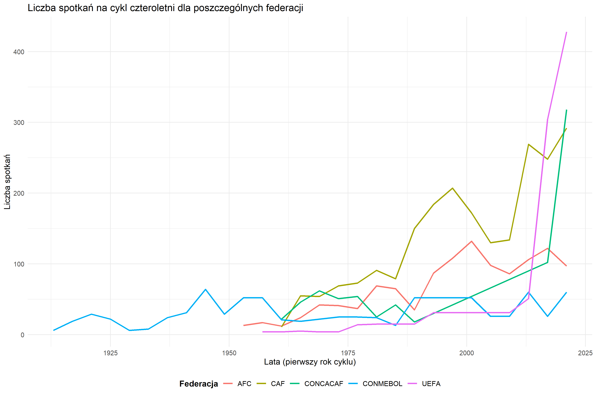

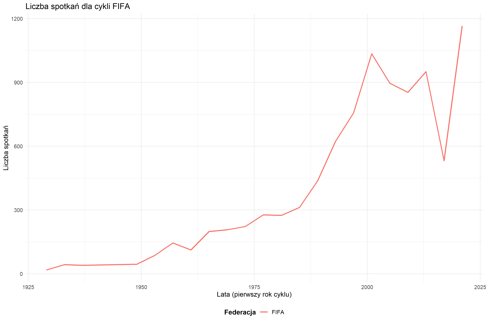

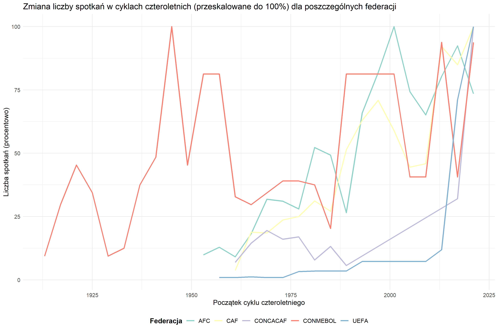


Niektóre analizowane federacje piłkarskie miały największą liczbę spotkań właśnie w ostatnim cyklu 4-letnim, w tym federacje, w których zrzeszona jest Polska reprezentacja w piłce nożnej, a mianowicie UEFA oraz FIFA. Ponadto, w ostatnich kilku cyklach następował gwałtowny wzrost liczby spotkań we wszystkich federacjach poddanych analizie.

## Inne czynniki kształtujące mecze reprezentacji

Poza omówionymi wcześniej aspektami, jakość emocji dostarczanych przez reprezentacyjną piłkę nożną zależy także od szeregu czynników organizacyjnych i fizycznych, które bezpośrednio wpływają na przebieg spotkań. Jednym z istotnych problemów jest konflikt interesów między klubami a reprezentacjami narodowymi. Formalnie zawodnicy są związani z klubami sportowymi, a ich udział w meczach reprezentacji odbywa się na zasadzie zgody klubu. Taka sytuacja rodzi napięcia, zwłaszcza gdy piłkarze doznają kontuzji w trakcie meczów reprezentacyjnych, co może wpłynąć na wyniki ich macierzystych drużyn w rozgrywkach ligowych i międzynarodowych. Konflikt ten często prowadzi do sytuacji, w których kluby niechętnie udostępniają swoich najlepszych zawodników, co obniża poziom gry w reprezentacjach.

Kolejnym problemem jest zmęczenie zawodników. Piłkarze rozgrywają coraz więcej spotkań w klubach, w tym w ligach krajowych, międzynarodowych pucharach i innych rozgrywkach. Mecze reprezentacyjne często przypadają na okres po intensywnych sezonach klubowych, kiedy zawodnicy nie są w stanie dać z siebie 100%, co odbija się na jakości gry. W szczególności dogrywki w takich spotkaniach stają się mniej emocjonujące, ponieważ zawodnicy są już wyczerpani i brakuje im energii, by podejmować ofensywne działania. W rezultacie wiele meczów kończy się rzutami karnymi, które, choć emocjonujące, bywają krytykowane za to, że sprowadzają wynik meczu do losowości. Konieczne jest zatem poszukiwanie alternatywnych sposobów na rozstrzyganie remisów, które byłyby bardziej sprawiedliwe i ekscytujące dla widzów.


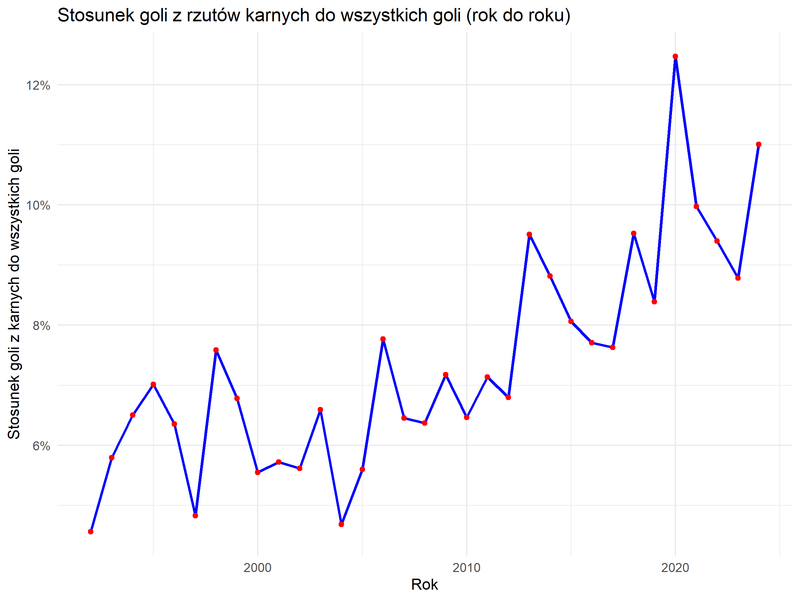


## Źródła

[1] https://www.youtube.com/watch?v=yGER2cPWgts

[2] https://sportsgazette.co.uk/is-obsession-about-possession-making-football-boring/

[3] https://scottishfsa.org/why-is-so-much-top-level-football-boring-nowadays/

[4] https://fumoetattica.medium.com/archive-why-is-modern-football-so-boring-54246b3d92b0

[5] https://longislandtennismagazine.com/article/no-ad-advantage-and-super-tie-break/

[6] https://www.nextgenatpfinals.com/en/event/rules-and-innovations